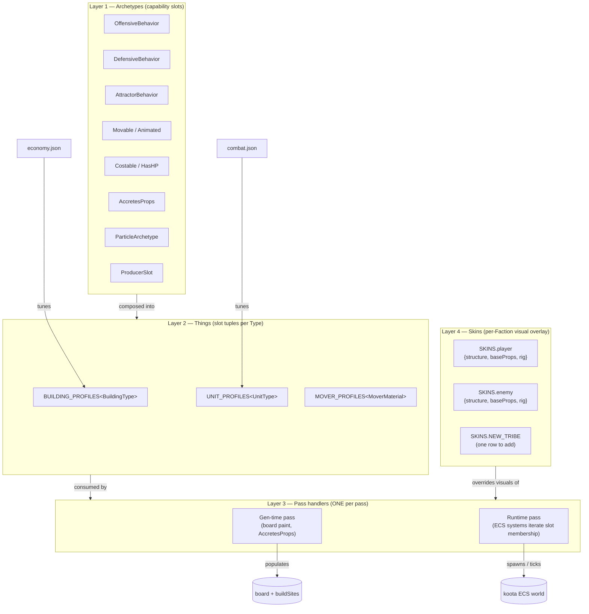

# Architecture

> **M_ARCH_UNIFY cross-reference (added 2026-05-23).** This pillar pre-dates
> the unified Thing/Skin registry. The 4-layer model — Archetypes →
> Things → Slots → Skins — is the authoritative architectural shape for
> every visual/data fork in the codebase. See:
>
> - `docs/specs/103-particle-archetype.md` — the keystone architectural pass
> - `src/rules/building-profiles.ts` — Thing registry (M_REGISTRY.5)
> - `src/rules/unit-profiles.ts` — Thing registry (M_REGISTRY.1)
> - `src/rules/mover-profiles.ts` — Thing registry (M_REGISTRY.11)
> - `src/rules/skins.ts` — Skin slot (M_REGISTRY.3/4/2)
>
> Any "what shape should this be?" question about a per-Thing-type table,
> a per-faction visual fork, or a multi-branch role/type switch resolves
> through this stack — NOT through new parallel hierarchies.

## The 4-layer model (M_ARCH_UNIFY)



The four layers map to four files in `src/rules/` plus the legacy
config JSON. **A new Thing type** = one row in the relevant
`*_PROFILES` registry + (for units) one stat block in combat.json.
**A new Skin (tribe)** = one row in SKINS + Faction-union extension +
nothing else. **A new archetype slot** = one row in the relevant
Profile interface + one consumer in the pass handler.

## Technology Stack

| Layer | Library / Tool | Role |
|---|---|---|
| Renderer | Three.js + React Three Fiber (`@react-three/fiber`) | 3D scene, lighting, camera |
| Animation | `@react-three/drei` useAnimations | Shared-rig GLB animation |
| ECS | `koota` | Simulation state and systems |
| UI | Radix UI primitives + framer-motion | HUD, modals, launcher |
| Audio | Howler.js | Buses: sfx / music / ambient / ui |
| Persistence | `@capacitor-community/sqlite` + `@capacitor/preferences` | Save/load, settings |
| Build | Vite 5 + TypeScript 5 | Web + native bundling |
| Native | Capacitor 6 (Android only) | APK packaging |
| Testing | Vitest (node + browser mode) + Playwright | Unit, integration, visual |
| Lint/Format | Biome | Code style enforcement |
| CI | GitHub Actions | Test + build + Pages deploy |

## Source Layout

```
src/
  core/        hex math, dual-PRNG, A* graph, constants — pure, no THREE/React
  ecs/
    components/  koota component definitions
    systems/     movement, pathfollow, harvest, build, combat, ai, weather, spawn
  world/       terrain generation, biome assignment, ramp placement, board r3f components
  entities/    character/building/resource r3f components; KayKit rig + animation loader
  render/      Canvas, lighting, day-night cycle, camera rig, particles, water plane
  audio/       howler buses (sfx/music/ambient/ui), event→sound mapping
  hud/         Radix + framer-motion: panels, minimap, launcher, win/loss modals
  game/        orchestration: game state machine, selection/command, save/load bridge
  persistence/ SQLite save schema, Preferences wrapper
public/assets/ curated GLB + OGG/WAV bundle organized by domain
docs/specs/    pillar documentation (this directory)
docs/milestones/ per-milestone contract docs
tests/
  unit/        core/ and ecs/systems/ pure logic tests (Vitest node mode)
  browser/     r3f component behavior tests (Vitest browser mode)
  visual/      screenshot comparison and Playwright e2e
```

## ECS as Single Source of Truth

The `koota` ECS world holds all simulation state. This is the central architectural
invariant of the project — the correction of poc2's failure mode, where game state was
scattered across dozens of global variables and functions that referenced each other
across file scope without a clear ownership model.

**The rule:** `core/` and `ecs/systems/` are pure TypeScript. They have no Three.js,
React, or DOM imports. They operate on component data only. `world/`, `entities/`,
`render/`, and `hud/` are React/r3f. They read ECS state via queries and render it.
They never write game logic; they call ECS system entry points or dispatch commands.

## Data Flow

```
User input (tap/click/key)
  → game/ command layer
    → koota ECS: entity creation / component mutation
      → ecs/systems/ run each frame (movement, harvest, combat, ai, weather, spawn)
        → r3f components read ECS state via useQuery hooks
          → Three.js renders geometry + materials
```

Every frame, the ECS systems update component values. r3f components subscribe to
those changes and derive Three.js transform/material/animation state from them. There
is no reverse flow from the renderer back into the ECS — r3f components are purely
reactive.

## Renderer Hoisting Rule

The r3f `<Canvas>` is hoisted to the top of the component tree, outside the HUD. The
HUD overlays are positioned absolutely over the canvas using CSS `z-index`. This avoids
the common failure mode of nesting a Canvas inside a deeply conditional component tree,
which causes remounts and lost WebGL context on state changes.

The game state machine (in `game/`) controls which HUD panels are visible via React
state; it does not unmount the Canvas or the ECS world during transitions.

## Module Boundaries

| Module | May import | May NOT import |
|---|---|---|
| `core/` | Nothing external | Three.js, React, koota, DOM |
| `ecs/components/` | `koota` types only | Three.js, React, `core/` utilities |
| `ecs/systems/` | `core/`, `ecs/components/` | Three.js, React, DOM |
| `world/`, `entities/`, `render/` | `core/`, `ecs/`, Three.js, r3f | `hud/`, `game/` |
| `hud/` | `ecs/` (read-only), Radix, framer-motion | Three.js directly |
| `game/` | All of the above | Nothing external not listed |
| `audio/` | Howler.js | React (called imperatively) |
| `persistence/` | Capacitor plugins | React, Three.js |
