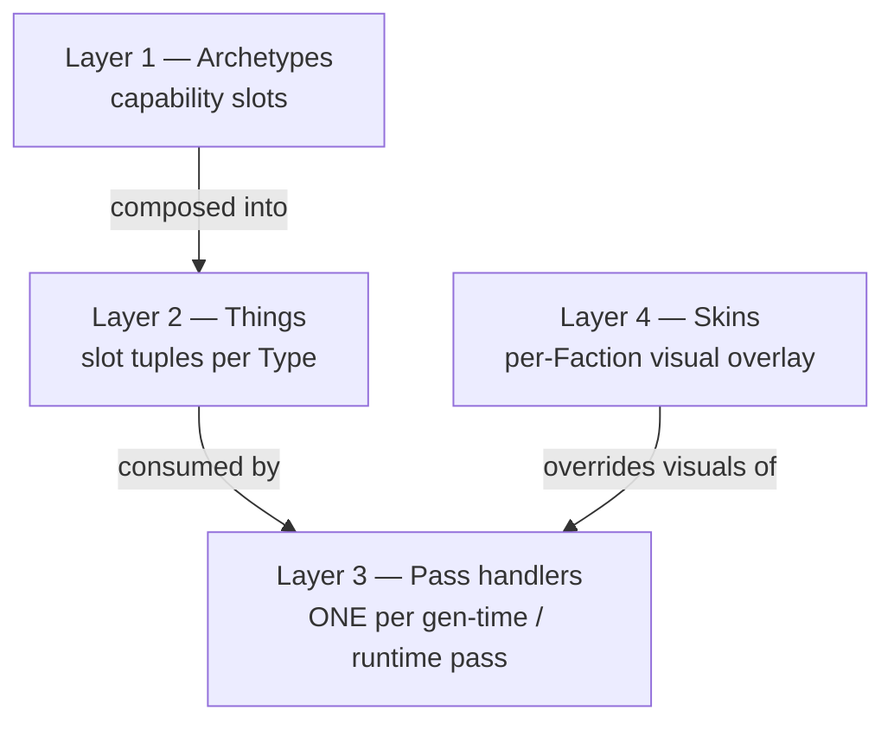
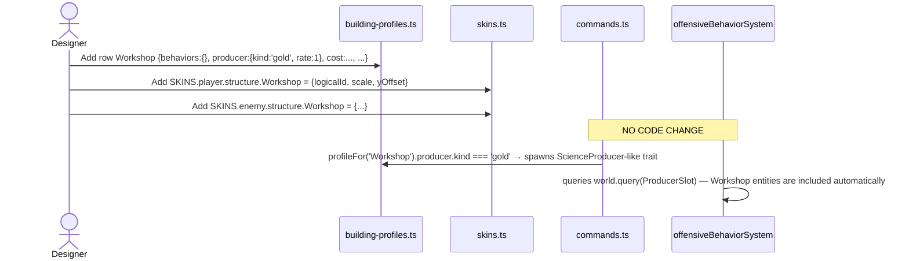
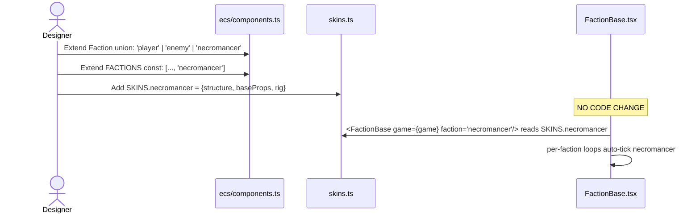

# 104 — M_ARCH_UNIFY: the unified Thing/Skin registry

Per the user's call-out: **"archetypal behavior is the most core. units
buildings etc are really higher ordered assigned archetypes with
different slot toggles like whether they have animation, should move,
how many spaces they move, etc. why is a building different than a
unit???"**

This pillar describes the unified architecture that supersedes every
parallel `Record<Type, X>` table previously scattered across the
codebase. Spec 102 (composition algebra) is the philosophy; this
spec is the mechanical realization.

(Numbered 104 to sit beside spec 103 — particle archetype — which is
the keystone architectural pass that produced this consolidation.)

## The 4-layer model

| Layer | What it is | Where it lives | Example |
|-------|-----------|----------------|---------|
| 1 — Archetypes | Capability slots; each is a koota trait + optional config shape | `src/ecs/components.ts`, `src/rules/*-profiles.ts` (slot interfaces) | `OffensiveBehavior`, `Movable`, `ParticleArchetype` |
| 2 — Things | Slot tuples per Type | `src/rules/building-profiles.ts`, `unit-profiles.ts`, `mover-profiles.ts` | `BUILDING_PROFILES.Watchtower = {behaviors: {offensive:...}, ...}` |
| 3 — Pass handlers | ONE function per pass that iterates slot membership | `src/world/` (gen-time), `src/ecs/systems/` (runtime) | `offensiveBehaviorSystem`, `runGenTimePass` (planned) |
| 4 — Skins | Per-Faction visual identity | `src/rules/skins.ts` | `SKINS.player.structure.Palace = {logicalId, scale, yOffset}` |

## Adding a new Thing — zero code changes

The factory + system code never branches on `type === 'Workshop'`; it
reads the slot. Adding the type is purely declarative.

## Adding a new Skin (tribe) — zero code changes

## Migration status (M_REGISTRY rollout)

| Ticket | Status | Coverage |
|--------|--------|----------|
| M_REGISTRY.1 (UNIT_PROFILES) | ✅ | character-factory.ts slot-driven |
| M_REGISTRY.2 (rig → Skin) | ✅ | rig.ts is legacy-API shim over Skin |
| M_REGISTRY.3 (structure-models → Skin) | ✅ | structure-models.ts is thin accessor |
| M_REGISTRY.4 (HomeBase + EnemyBase → FactionBase) | ✅ | 191 LOC of parallel components deleted |
| M_REGISTRY.5 (BUILDING_PROFILES) | ✅ | 5 parallel tables collapsed |
| M_REGISTRY.6 (Particle archetype) | ✅ | ParticleEmitter unified; 4 emitters delete; spec 103 |
| M_REGISTRY.7 (AccretesProps slot) | ✅ | base+building accretion on Skin/BUILDING_PROFILES |
| M_REGISTRY.8 (useDecorationGltfs derive) | audited | rules-of-hooks anchors hand-listed DECO_IDS |
| M_REGISTRY.9 (gen-time paint pipeline) | ✅ | GEN_TIME_PIPELINES table per mapType |
| M_REGISTRY.10 (Mountains peakLevel slot) | ✅ | per-biome peakLevel flag |
| M_REGISTRY.11 (MOVER_PROFILES) | ✅ | Roads.tsx reads moverProfileFor() |
| M_REGISTRY.12 (Crossings 6-variant table) | ✅ | CROSSING_PROFILES keyed by `${form}:${style}` |
| M_REGISTRY.13 (place* verbs) | audited | only 2 place verbs today; unify at 4+ |
| M_REGISTRY.14 (baseKeyFor) | ✅ | single faction → baseKey lookup |
| M_REGISTRY.15 (escalation table) | ✅ | declarative ESCALATION_SCHEDULE |
| M_REGISTRY.16 (FACTIONS const) | ✅ | per-faction loops iterate FACTIONS |
| M_REGISTRY.17 (combatRole slot) | ✅ | MILITARY_ROLES derived; latent Trebuchet bug fixed |
| M_REGISTRY.18 (Brain archetype) | spec done, impl pending | see spec 105 |
| M_REGISTRY.19 (selectionRadius slot) | ✅ | SelectionRing slot-driven |
| M_REGISTRY.20 (Skin.audio slot) | audited | step-N when a tribe needs distinct sounds |
| M_REGISTRY.21 (biome cliffColor) | ✅ | cliffColor slot on BIOME_FLAGS |
| M_REGISTRY.22 (BIOME_FLAGS) | ✅ | walkable/buildable/habitable/lushBlend per biome |
| M_REGISTRY.23 (hexDistance dedup) | ✅ | 2 hand-rolls collapsed; AXIAL_NEIGHBORS via HEX_DIRECTIONS |
| M_REGISTRY.24 (resource-spawn unify) | landed via M_EXPANSION.S.52 | biomes + topupAmount slots on RESOURCE_PROFILES; attractor reads from there |
| M_REGISTRY.25 (SERIALIZED_TRAITS) | ✅ | LATENT BUG FIX: 7 archetype traits weren't round-tripping |
| M_REGISTRY.26 (static-assets derive) | audited | auto-generated by vite plugin |
| M_REGISTRY.27 (Minimap colors → Skin) | ✅ | SKINS[faction].minimap slot |
| M_REGISTRY.28 (local-observer faction) | audited | step-N when AI-vs-AI replay lands |
| M_REGISTRY.29 (FACTIONS literal loops) | ✅ | 2 hand-unrolled loops collapsed |
| M_REGISTRY.30 (OffensiveBehavior targetsRule) | audited | step-N (3+ factions) |

### M_AUDIT2 follow-on rollout (post-50-commit unification)

| Ticket | Status | Coverage |
|--------|--------|----------|
| M_AUDIT2.ARCH.1 (BIOME_FLAGS.decorationDensity) | ✅ | density scalar lifted; prop pools stay (hooks anchor) |
| M_AUDIT2.ARCH.2 (RESOURCE_DISPLAY) | ✅ | 3 parallel resource-display tables collapsed |
| M_AUDIT2.ARCH.3 (zoneBorderColor Skin slot) | ✅ | ZONE_COLOR table removed |
| M_AUDIT2.ARCH.4 (RESOURCE_PROFILES) | ✅ | mesh + tint + harvestYield per resource |
| M_AUDIT2.ARCH.5 (WEATHER_PROFILES) | ✅ | label + speedMultiplier per weather state |
| M_AUDIT2.ARCH.42 LATENT BUG | ✅ | offensive-behavior.ts hp mutation was no-op since spec-102 |

Remaining open tickets drain from the 163-finding M_AUDIT2 batch
(architecture/security/UX). The keystone unification is closed;
remaining work is incremental coverage + the heavyweight BrainArchetype
implementation (per spec 105's step-by-step rollout).

## Doctrine

Per the user's `ONE UNIFIED PRODUCTION CODEBASE` mandate: if a new
feature wants a per-Type or per-Faction fork that doesn't fit an
existing slot, **extend the Profile interface** rather than adding a
parallel table. The codebase is not "factor everything to maximum
abstraction" — it is "no parallel hierarchies; one slot taxonomy."

If the slot you need doesn't exist yet, the addition is:

1. Extend the relevant Profile interface (`BuildingProfile` or
   `UnitProfile` or `Skin`) with the new slot.
2. Add the value to every existing row (TypeScript forces this).
3. Add ONE consumer in the relevant pass handler (factory or system).
4. Never spawn a new top-level `Record<Type, X>` map.

That's M_ARCH_UNIFY in one paragraph.
