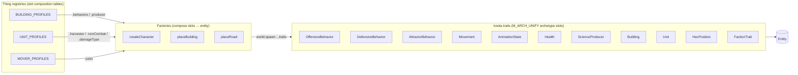

# ECS Model

> **M_ARCH_UNIFY cross-reference (added 2026-05-23).** Pre-dates the
> unified Thing/Skin registry. The 4-layer model — Archetypes → Things
> → Slots → Skins — is the authoritative architectural shape for every
> visual/data fork in the codebase. See:
>
> - `docs/specs/103-particle-archetype.md` — keystone architectural pass
> - `docs/specs/10-architecture.md` — pillar's full M_ARCH_UNIFY block
> - `src/rules/building-profiles.ts` — Thing registry (M_REGISTRY.5)
> - `src/rules/unit-profiles.ts` — Thing registry (M_REGISTRY.1)
> - `src/rules/skins.ts` — Skin slot (M_REGISTRY.3/4/2)
>
> Per-section notes below mark where THIS pillar's text became
> superseded or extended by the unified-registry doctrine.

The simulation uses `koota` as the Entity Component System library. All game objects
are entities; all properties are components; all behavior is implemented in pure
systems. The ECS world is created once at game start and persists for the lifetime of
a play session.

## Slot taxonomy (M_ARCH_UNIFY layer 1 → layer 2)



Every spawn site (factory) reads the relevant Profile registry, picks
the slot values, and assembles the trait tuple. The Factory layer is
the boundary between **data (Profiles)** and **runtime (Traits on
entities)**; ECS systems then iterate by querying trait membership.
**Adding a new capability slot** = add the trait + extend a Profile
interface + add ONE consumer in the factory or in a system.

## Component Catalog

| Component | Type | Description |
|---|---|---|
| `Transform` | `{ position: Vector3, rotation: Quaternion, scale: Vector3 }` | World-space transform. R3f reads this to drive the Three.js object |
| `HexPosition` | `{ q: number, r: number, level: number }` | Tile the entity occupies. Source of truth for logical grid position |
| `Unit` | `{ unitType: UnitType, playerId: number }` | Marks as a unit; identifies unit class and owning player |
| `Faction` | `{ faction: "player" \| "enemy" }` | Ownership for targeting and AI |
| `Health` | `{ current: number, max: number }` | Hit points. Drives health bar rendering |
| `Movement` | `{ speed: number, isMoving: boolean }` | Movement capability and current motion state |
| `PathQueue` | `{ steps: HexKey[], targetQ: number, targetR: number }` | Remaining A* path steps to destination |
| `Harvester` | `{ resourceType: ResourceType, harvestTimer: number, harvestRate: number }` | Marks as able to harvest resources; tracks harvest progress |
| `Carrier` | `{ carryType: ResourceType \| null, carryAmount: number, carryMax: number }` | Current carried load; null means empty |
| `Building` | `{ buildingType: BuildingType, isComplete: boolean, progress: number }` | Marks as a building; tracks construction progress |
| `Resource` | `{ resourceType: ResourceType, amount: number }` | Marks as a harvestable resource node |
| `Combatant` | `{ attackDamage: number, attackRange: number, attackCooldown: number, attackTimer: number }` | Combat stats; drives the attack state machine |
| `AnimationState` | `{ state: AnimState, clipName: string }` | Current animation state; r3f reads this to drive `useAnimations` |
| `Selectable` | `{ isSelected: boolean }` | Whether the entity is currently selected by the player |

### Enumerations

```typescript
type UnitType = "Peon" | "Footman" | "Goblin" | "Orc";
type BuildingType = "Palace" | "Farm" | "Barracks" | "EnemyBase";
type ResourceType = "wood" | "stone" | "gold";
type AnimState = "IDLE" | "MOVING" | "HARVESTING" | "ATTACKING" | "DYING" | "BUILDING";
type HexKey = string; // format: "${q},${r}"
```

## Entity Archetypes

Each archetype is a fixed set of components. The character factory and building factory
each produce exactly one archetype type, parameterized by role.

| Archetype | Components |
|---|---|
| **Peon** | Transform, HexPosition, Unit(Peon), Faction(player), Health(50), Movement(2), PathQueue, Harvester, Carrier, AnimationState, Selectable |
| **Footman** | Transform, HexPosition, Unit(Footman), Faction(player), Health(100), Movement(2.5), PathQueue, Combatant(15dmg), AnimationState, Selectable |
| **Goblin** | Transform, HexPosition, Unit(Goblin), Faction(enemy), Health(60), Movement(2), PathQueue, Combatant(8dmg), AnimationState |
| **Orc** | Transform, HexPosition, Unit(Orc), Faction(enemy), Health(150), Movement(1.5), PathQueue, Combatant(20dmg), AnimationState |
| **Palace** | Transform, HexPosition, Building(Palace,complete), Faction(player), Health(500), Selectable |
| **Farm** | Transform, HexPosition, Building(Farm), Faction(player), Health(100) |
| **Barracks** | Transform, HexPosition, Building(Barracks), Faction(player), Health(150), Selectable |
| **EnemyBase** | Transform, HexPosition, Building(EnemyBase,complete), Faction(enemy), Health(300) |
| **ResourceNode** | Transform, HexPosition, Resource(type,amount) |

## System Catalog and Run Order

Systems run each frame in this fixed order. Earlier systems in the order may produce
state that later systems read in the same frame.

| # | System | Description |
|---|---|---|
| 1 | `weatherSystem` | Advances the weather state machine (sunny → fog → rain → sunny) using the event PRNG. Updates sky color and ambient light. |
| 2 | `spawnSystem` | Checks spawn timers; creates new Goblin/Orc entities at the EnemyBase when spawn conditions are met. |
| 3 | `aiSystem` | For each enemy entity: if no PathQueue, pick a target (nearest player unit or Palace) and compute A* path. |
| 4 | `pathFollowSystem` | For all entities with PathQueue: advance position along the path. Pops completed steps. Sets `isMoving`, updates HexPosition when a step completes. |
| 5 | `movementSystem` | Applies velocity from `Movement` and `PathQueue` to `Transform.position` each frame. |
| 6 | `harvestSystem` | For peons with Harvester + PathQueue empty + adjacent to a ResourceNode: tick harvestTimer. On completion: fill Carrier, reduce ResourceNode.amount, set AnimationState(HARVESTING). |
| 7 | `buildSystem` | For peons assigned to build: path to the building site, tick build progress. On completion: set Building.isComplete. |
| 8 | `combatSystem` | For all Combatant entities: tick attackTimer. When timer fires AND an enemy is in range: apply damage (with event PRNG crit roll), create floating combat text, reduce target Health. |
| 9 | `depositSystem` | For carriers with full Carrier at or adjacent to Palace: add resources to global economy state, clear Carrier, return Harvester to idle. |
| 10 | `deathSystem` | For entities with Health.current ≤ 0: set AnimationState(DYING), schedule entity removal after death animation completes. |
| 11 | `winLossSystem` | Check: if EnemyBase entity gone → trigger win. If Palace entity gone → trigger loss. |

## Serialization

The full ECS state is serializable to JSON for save/load. Each entity is represented
as `{ id, components: { [componentName]: componentData } }`. The serialization format
is defined in `95-persistence.md`. Systems must not hold state outside component data —
any value that must survive a save/load must live in a component.
