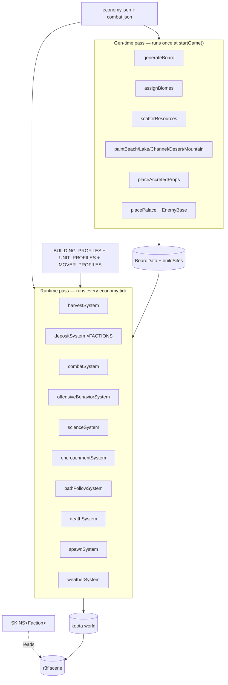

# RTS Systems

> **M_ARCH_UNIFY cross-reference (added 2026-05-23).** Pre-dates the
> unified Thing/Skin registry. The 4-layer model — Archetypes → Things
> → Slots → Skins — is the authoritative architectural shape for every
> visual/data fork in the codebase. See:
>
> - `docs/specs/103-particle-archetype.md` — keystone architectural pass
> - `docs/specs/10-architecture.md` — pillar's full M_ARCH_UNIFY block
> - `src/rules/building-profiles.ts` — Thing registry (M_REGISTRY.5)
> - `src/rules/unit-profiles.ts` — Thing registry (M_REGISTRY.1)
> - `src/rules/skins.ts` — Skin slot (M_REGISTRY.3/4/2)
>
> Per-section notes below mark where THIS pillar's text became
> superseded or extended by the unified-registry doctrine.

Each system described here is reconstructed from `references/conversation.md`. Every
system has explicit acceptance criteria — these become milestone contract tests.

## Two-pass model (M_ARCH_UNIFY layer 3)



Every runtime system iterates **slot membership** (`world.query(Trait)`)
rather than branching on type. Adding a new system = add ONE consumer
of the relevant slot; adding a new Thing type drops into all existing
systems automatically because it carries the same traits.

## Economy System

### Peon Harvest Loop

The core economic loop runs autonomously once peons exist and resources are on the map.

**State machine per peon:**

1. **IDLE** — Peon has no assignment. The idle-peon button highlights it.
2. **SEEKING** — Peon has a resource target. A* path computed to the resource's hex.
3. **HARVESTING** — Peon is adjacent to a resource node. `harvestTimer` counts up at
   `harvestRate` per second. `AnimationState` → `HARVESTING` (axe-swing clip).
4. **CARRYING** — Peon's Carrier is full. A* path computed back to Palace.
5. **DEPOSITING** — Peon is adjacent to Palace. Resources added to global totals.
   Carrier cleared. Peon returns to SEEKING the same resource type if node is not
   depleted, otherwise IDLE.

**Resource types and yield per harvest tick:**
- `wood` — from FOREST tiles' tree props; 10 wood per harvest cycle.
- `stone` — from HIGHLAND / MOUNTAIN tile rock props; 8 stone per harvest cycle.
- `gold` — from dedicated gold vein props placed by map PRNG; 5 gold per harvest cycle.

**Acceptance criteria:**
- A peon assigned to a resource node reaches it, completes harvest animation, carries
  load back to Palace, deposits, and repeats without player intervention.
- Resource node amount decreases with each harvest. When depleted (amount ≤ 0), the
  peon enters IDLE.
- Global resource counters in the HUD update immediately on deposit.

### Supply System

Each unit consumes supply capacity from its faction's pool; buildings
add supply when complete. The Palace is the starting structure and
provides the base capacity.

> **M_AUDIT2.ARCH.37 — regenerated from data sources 2026-05-23.**
> Supply values below are derived from `src/config/economy.json` +
> `src/rules/unit-profiles.ts`. If these tables disagree with code,
> the code is truth (per spec drift rule); re-regenerate this section.

**Supply costs** (from `economy.json` → `supplyCosts`):

| Unit | Supply cost |
|---|---|
| Peon | 1 |
| Settler | 4 |
| Footman | 2 |
| Trebuchet | 3 |
| Goblin | 0 (enemy — not supply-tracked) |
| Orc | 0 |
| Vampire | 0 |
| Witch | 0 |
| BlackKnight | 0 |

**Supply provided** (from `economy.json` → `buildingSupply`):

| Building | Supply provided |
|---|---|
| Palace | 5 |
| Farm | 10 |
| House | 4 |
| Granary | 2 |
| Wonder | 5 |
| Barracks / Watchtower / Wall / Library | 0 (not supply structures) |

**Hard cap:** total supply is capped at the sum of all owned buildings' supply. Players
cannot train units that would exceed their current supply cap. The HUD displays
`current/max` supply.

**Acceptance criteria:** Training a footman that would exceed supply shows a "Need more
supply" error message and does not create the unit.

## Build Mode

Players enter build mode by clicking a building button (Farm or Barracks) in the HUD.
A ghost (semi-transparent preview) of the building follows the cursor over valid hex
tiles.

**Placement rules:**
- Target tile must be GRASS, HIGHLAND, or BEACH biome.
- Target tile must be unoccupied (no unit, resource node, or existing building).
- Player must have sufficient resources (Farm: 100 wood, 50 gold; Barracks: 150 wood,
  100 stone, 50 gold).

**On placement confirmation:**
1. Resources deducted from global totals.
2. Building entity created with `Building.isComplete = false`, `Building.progress = 0`.
3. Nearest idle peon is auto-assigned to the construction site.
4. Peon paths to the site and enters BUILD state. `harvestTimer` is repurposed as
   build progress timer.
5. A progress ring (arc mesh or CSS overlay) shows build completion percentage.
6. When `progress >= 1.0`: `Building.isComplete = true`, peon returns to IDLE.

**Acceptance criteria:** Placing a Farm deducts resources, spawns an incomplete Farm
building, a peon walks to it and builds it over time, and the Farm's supply contribution
activates when `isComplete = true`.

## Combat System

### Footman/Goblin State Machine

**Attack sequence for any Combatant entity:**

1. **PATROLLING/IDLE** — No target in range.
2. **CHASING** — Enemy unit detected within a search radius (5 hex tiles). A* path
   computed to the enemy.
3. **ATTACKING** — Enemy is within `attackRange` (1 tile for melee, 2 for ranged).
   `attackTimer` counts down. On zero: deal damage roll, reset timer.
4. **DYING** — Health ≤ 0. Death animation plays. Entity removed after clip ends.

**Damage roll (uses event PRNG):**
```
damage = attackDamage + randomInt(0, 3)
isCrit = random() < 0.1
if isCrit: damage *= 2
```

**Health billboard:** A floating bar above each combat unit. Green when Health > 50%,
yellow when 25–50%, red when < 25%. The billboard always faces the camera (billboarding
via Three.js `lookAt`). Only visible when Health < max (full-health units show no bar).

**Floating combat text:** On each hit, a `+N` (for heals) or `-N` (for damage) text
popup floats upward from the target's world position and fades out over 1.6 seconds.
Crits display in larger font with `★` prefix. Source: poc2.html `.popup-text` style
and `floatUp` keyframe animation.

**Acceptance criteria:**
- A footman encounters a goblin, attacks it, deals damage that reduces its health,
  and the goblin dies when health reaches 0.
- Health billboard updates immediately after each hit.
- Floating text appears at the correct world position and fades naturally.
- Crits occur at approximately 10% rate over a large sample.

## Weather System

Weather cycles through three states driven by the event PRNG on a timer (approximately
every 90–180 seconds of game time, randomized per transition).

| State | HUD label | Visual effect | Audio |
|---|---|---|---|
| Sunny | `☀️ Sunny Skies` | Bright ambient light, no particles | Birdsong ambient loop |
| Fog | `🌫️ Thick Fog` | Reduced directional light intensity, fog `FogExp2` on scene | Low drone ambient loop |
| Rain | `🌧️ Heavy Rain` | Rain particle system, darker sky, reduced movement speed -20% | Rain ambient loop |

**State machine:** Sunny → Fog OR Rain (50/50) → Sunny → repeat. Weather never
transitions directly from Fog to Rain or vice versa; it always returns to Sunny first.

**Acceptance criteria:**
- Weather transitions occur during gameplay without player input.
- The HUD weather indicator updates on each transition.
- Rain applies the movement speed penalty to all non-building entities.
- The same seed phrase always produces weather transitions at the same game-time marks.

## Research System

The Barracks building (once constructed) exposes a Research panel in the HUD when
selected. Two research upgrades are available:

| Research | Cost | Effect |
|---|---|---|
| Forged Blades | 150 gold, 100 stone | All footmen: `Combatant.attackDamage += 5` permanently |
| Steel Plows | 100 gold, 50 wood | All peons: `Harvester.harvestRate *= 1.5` permanently |

Research is one-time per session — once purchased, the upgrade cannot be re-purchased.
The Barracks shows the research as greyed-out and labelled "Researched" after purchase.

Research takes 30 seconds (a build timer visible as a progress bar in the Barracks
selection panel). During research, the Barracks cannot train units.

**Acceptance criteria:**
- Forged Blades purchased → subsequent footman attacks deal 5 more damage per hit.
- Steel Plows purchased → peon harvest cycles complete in 33% less time.
- Research cannot be purchased twice.
- Research timer is visible in the HUD.

## Rally Points

When a Barracks is selected and the player taps a tile on the board (not a unit), a
rally marker is placed at that tile. Newly trained footmen automatically path to the
rally point after training completes.

The rally marker is a small flag prop placed on the target tile. Only one rally point
per Barracks at a time — setting a new rally removes the old marker.

**Acceptance criteria:**
- Trained footman walks to the rally point tile immediately after training.
- Rally marker is visible on the board as a distinct prop.
- Changing the rally point updates the marker position instantly.

## Win / Loss Conditions

**Win:** The EnemyBase entity's Health reaches 0. The `winLossSystem` detects the
Portal entity removal and triggers the win flow:
1. All enemy AI stops.
2. The win modal appears with `modal-title-win` styling (gold `#fbbf24`, Metamorphous
   font, "Victory!" text).
3. Stats shown: Gold Earned, Lumber Harvested, Enemies Vanquished.

**Loss:** The Palace entity's Health reaches 0. The `winLossSystem` detects this
and triggers the loss flow:
1. All player input is disabled.
2. The loss modal appears with `modal-title-loss` styling (red `#ef4444`, "Defeat!").
3. Stats shown: same set as win modal.

Both modals include a "Re-enter Aethelgard" button that calls `location.reload()` to
reset to the launcher.

**Acceptance criteria:**
- Reducing the EnemyBase to 0 HP triggers the victory modal.
- Reducing the Palace to 0 HP triggers the defeat modal.
- No player input is accepted after either modal appears.
- Stats accurately reflect the completed session's totals.

## Enemy AI

The enemy AI runs in `aiSystem` each frame. For each enemy entity with no current path:

1. Find the nearest player-faction entity (unit or Palace) within a 10-tile radius.
2. Compute A* path to that target's hex.
3. Assign the path to the entity's PathQueue.

Goblins spawn from the EnemyBase on a timer (every 45 seconds at base rate, reduced
by 10% per surviving footman). They always target the nearest player unit first; if no
units exist, they target the Palace directly.

Orcs spawn after the player has 3 or more footmen or the game clock exceeds 10 minutes,
representing an escalating threat.

**Acceptance criteria:**
- Goblins path toward player units without player input.
- Goblins retarget when their current target dies.
- Spawn rate increases as the game progresses.
