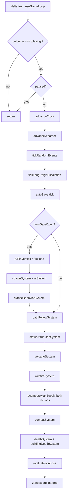
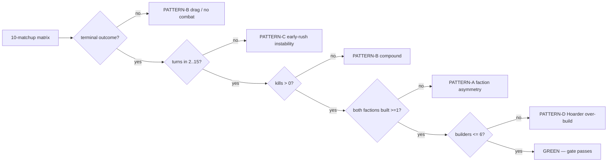

# PRD: Aethelgard v0.4 — "Make it FUN"

> "we have the GAME. now we need to make it FUN."
> — user, 2026-05-24

## 1. Context

v0.3.0 shipped a functionally complete game: 6 modes, 6 buildings,
7 unit types, AI, combat, economy, persistence, deployed to
GitHub Pages + signed Android APK. See `docs/MILESTONES.md` for
the historical record.

The game **works**. The game is **not fun**. v0.4 closes that gap.

## 2. Problem statement

Players who load the deployed Pages today see:

- **Repetitive maps.** Every match looks like the last: a hex
  island with a centre-stamped mountain blob, two mirror-symmetric
  bases, deterministic resource scatter.
- **Single-axis combat.** Push military, kill base. No counter
  mechanics, no compositions, no surprises.
- **Static terrain.** Mountains are walls; forests are decoration;
  swamps don't exist; ranged units don't care about elevation.
- **AI without character.** Enemy plays the same script every
  time. Nothing to remember.
- **Modes don't differentiate.** The 6 game modes feel like the
  same game with different timers; no per-mode mechanical
  identity (the user can name them but can't say WHY they're
  different to play).

The game produces matches but not stories. Replay value comes
from generating variety, not from random seeds rolling the same
shape.

## 3. Goals (v0.4)

1. **Per-mode mechanical identity.** Each of the 6 modes plays
   differently because the underlying mechanics differ, not
   because a timer is shorter. Border-clash IS choke-and-funnel;
   frontier-raid IS asymmetric harassment; long-reign IS
   attrition; strata-wars IS layered control; age-of-strata IS
   exploration; coexistence IS sandbox.
2. **Terrain that decides.** Every biome is a meaningful player
   decision: mountain passes (fortifiable choke), swamps (need a
   Healer to cross), forests (line-of-sight blocker), elevation
   (ranged advantage). Choosing where to fight matters more than
   who has more units.
3. **Composition pressure.** Some chokes demand specific unit
   types (Healer to clear swamp disease, Trebuchet to break Wall).
   A 1-unit-type army loses.
4. **AI personalities.** Each enemy is a named opponent with a
   biased strategy (Builder, Raider, Hoarder, Diplomat, Mad King)
   and an exploitable flaw. Players learn the matchup.
5. **Narrative texture.** Matches end with a generated highlight
   reel + an auto-named "story of the match" the player remembers.
6. **Visual coverage.** Every new feature ships with an isolated
   visual harness test the agent reviews before commit.
7. **Config-driven scaling.** Adding a new biome / mapType /
   mode = 1 config row + 1 harness test. No new if/then ladders.

## 4. Non-goals (v0.4)

- Multiplayer / netcode.
- 3+ faction modes.
- Steam release.
- Asset overhaul.

These are v1.0+ topics; v0.4 is single-player polish + texture.

## 5. Success criteria

A player who has finished one match wants to play another because
they want to:

- See what the map gen produces (genuine variety, not seed
  reshuffle)
- Try a different opponent personality
- Try a different mode and feel a different game
- Reach a mechanic they haven't unlocked yet (Wonder paths,
  Sacred Grove discovery, ancient ruins)
- See another generated highlight reel

Operational metrics:

- Default match watched by the agent in chrome-devtools-mcp surfaces
  a screen-readable mechanic decision every 30 sec (build choice,
  composition pivot, choke commitment) instead of long stretches of
  "wait for resources".
- The agent can review the deployed game and articulate the
  HEADLINE mechanic of each of the 6 modes in one sentence.
- A single seed at `?ai-vs-ai=1&seed=X` plays to a deterministic
  finish AND produces a generated story-card.

### 5.1 Playable-match validation gate (M_FUN.QA.AIVAI) — v0.4 RELEASE BLOCKER

Unit tests prove the SYSTEMS work; they do NOT prove a match
finishes in a reasonable turn count with real activity. Without
this gate we ship balance changes blind and the user — not the
agent — discovers when matches end in 5 seconds, drag forever,
or have zero combat.

A Playwright AI-vs-AI suite MUST land GREEN before v0.4 ships,
covering:

- One self-play run per personality (5 runs).
- One cross-matrix run per personality pair (10 unordered pairs).
- Each run boots in AI-vs-AI mode at gameSpeed≥4 and asserts
  WITHIN A WALL-CLOCK BUDGET that:
  - `game.outcome` reaches a terminal value (win/loss/draw) —
    the sim actually CAN finish under autonomous play.
  - Elapsed turn-count is in a sensible band (≥ ~30 turns, ≤ ~300
    turns) — instant finishes AND drags are both balance failures.
  - Activity counters cross thresholds: kills > 0 (combat
    happened), buildings per faction > 2 (builds happened), supply
    peaked above start (training happened).
- Run output (turns, kills, builds, outcome) goes to
  `tests/e2e/__data__/ai-balance-runs.json` for trend tracking.

This runs in CI tier-2 (on-demand) or as a nightly job to keep
tier-1 fast. It does NOT block per-commit CI. It DOES block
v0.4 release.

### 5.2 Balance-run failure taxonomy (M_FUN.QA.AIVAI.TUNE)

The first comprehensive matrix run (all 10 matchups, 10 sim-minute
budget) surfaced FIVE distinct failure patterns + one instability
edge case. Each is a release-blocker until passing.

**Pattern A — FACTION ASYMMETRY (8 of 10 matchups).** Player faction
systematically out-develops enemy faction REGARDLESS of personality;
mad-king-vs-builder inverts the asymmetry (enemy=8 buildings,
player=1). This rules out personality as the root cause and points
at faction-specific bias — resource cluster placement biased toward
one side, or peon SEEKING gradient creating one-sided harvest. Fix
must be FACTION-SYMMETRIC at game-gen and at runtime.

**Pattern B — ZERO COMBAT (9 of 10 matchups, 10 sim-minute runs).**
totalKills = 0 in 9 of 10 runs. MilitaryEvaluator fires only when
`discoveredEnemyTile()` is non-null. Two faction starts ~5-10 hexes
apart never expand observation enough to discover each other under
the default vision cone. Fix: either grow zone observation faster
(starting-Footman patrol radius), or have MilitaryEvaluator fall
back to attractor-target the opposing baseKey at threshold time
(once military > N or wall-clock > T).

**Pattern C — INSTABILITY (diplomat vs raider).** Win in 1 turn,
4 chunks (~40s wall-clock), 2 kills. A lone Footman lucky-rushed
the diplomat TownHall before the diplomat had any military. Healthy
matches don't end in 40s. The harness should tighten its lower
bound from `elapsedTurns >= 1` to `>= 2` (i.e. >= 2 sim-min) so
single-Footman rushes fail the gate as the imbalance they are.
Fix the GAME so the early game isn't lethal to a peaceful
personality (Town Hall has 300 HP — should survive a single
Footman attack; investigate whether Footman damage is mis-tuned).

**Pattern D — HOARDER OVERBUILDS (hoarder/hoarder, mad-king/builder).**
Saturation cap from M_FUN.QA.AIVAI.TUNE round-1 didn't bite (Hoarder
hit 9 buildings, mad-king-side enemy hit 8). Saturation curve needs
to begin earlier or be sharper. Or: hard cap of 8 complete buildings
per faction with the AI flipping to "all military" after.

**Pattern E — MAD-KING IS PASSIVE.** mad-king/mad-king produces the
LOWEST building counts (1, 0) and 0 kills. "Mad king" personality
suggests erratic-aggressive but the weights (build 0.4, military
high) somehow translate to inert. Fix: review personality weight
shape vs intent for ALL 5 personalities, not just Mad King.

**Pattern F — ENEMY BUILD COMPLETION (builder/raider player=6 enemy=0).**
Even with resource imbalance, ZERO enemy buildings complete in 10
sim-minutes for some matchups. The Pattern A asymmetry compounds:
enemy faction may build SITES but they never complete because peons
don't reach BUILDING state OR build progress doesn't accrue.

Order to fix: A (faction symmetry) → F (build completion) → B
(combat discovery) → C (early-game safety) → D (saturation) →
E (personality intent audit). Re-run the matrix after each fix;
delta on the JSON ledger is the evidence. Each fix earns its own
sub-task in the directive.

### 5.3 Use the full board (M_FUN.MAP.UTILISATION)

Observation from running the balance matrix at the visual level:
the current maps waste enormous amounts of the board on water +
border islands. Two factions clump in a strip across the middle
while 40%+ of the hex grid is dead ocean. This:

- Caps how interesting a 10-min match can be (no room to maneuver).
- Makes some matchups physically impossible (factions can't reach
  each other when an inland sea cuts the map in half).
- Wastes asset budget on terrain the player never interacts with.

Required for v0.4 release:

- **Shallows-bridging contract.** The existing
  beach→grass elevation bridge has a direct counterpart: shallow
  water between islands should be CROSSABLE by units with an
  "aquatic" trait (Settlers + future amphibious unit), at higher
  move-cost. Deep ocean stays impassable. Map gen layers shallows
  as a 2-3 hex skirt around each landmass.
- **Multi-island maps as a first-class mapType.** Today every
  generated map is "1-2 landmasses + ocean filler". Add an
  archipelago variant that places 3-7 islands with shallows
  channels, plus a continent-with-inland-lakes variant that uses
  the centre as a contested water feature. Selectable in the
  mapType registry alongside the existing dry-land / archipelago /
  balanced / continent options (which the implementation only
  PARTIALLY supports — verify each renders distinct geometry).
- **Aquatic skill / unit class.** A trainable that converts a Peon
  into a "Ferryman" (or similar) — speed penalty on land but able
  to cross shallows. Adds a build-order strategic choice: do you
  spend the wood on a Footman or a Ferryman to claim the second
  island?
- **Map-utilisation metric in the AIVAI harness.** Add a new
  assertion: # of distinct tiles touched by either faction's
  zone of control > UTILISATION_FLOOR (e.g. 30% of walkable
  board). Catches future regressions where a balance change makes
  factions cluster instead of expand.

### 5.4 Visual review at every step (M_FUN.QA.AIVAI.VISUAL)

Per the visual-ownership rule in CLAUDE.md: any change to the
balance harness MUST capture a final-frame screenshot per run.
The screenshot lands in `tests/e2e/__data__/aivai-screens/<outcome>/`
(gitignored — large + churns) with a self-narrating filename
(`<player>-vs-<enemy>_t<turns>_k<kills>_b<pl>-<en>.png`). The
agent reviews these visually between tuning rounds — clumping,
peons walking off-map, units stuck at impassable tiles, all of
which the numeric ledger can't surface alone.

## 6. Architecture prerequisites

Two structural shifts MUST land before per-mechanic work, or the
mechanic work won't scale. These are M_FUN.ARCH in the directive.

### 6.1 Config-driven biome + mapgen rules (M_FUN.ARCH.CONFIG)

Every per-mode and per-biome generation value moves to
`src/config/mapgen.json`, Zod-validated. Generator reads the
config + iterates rows. Adding a new mapType or biome = 1 config
row, 0 code.

Schema sketch:

```jsonc
{
  "mapTypes": {
    "balanced": {
      "passes": ["beachRing", "mountainMassif", "inlandLake", "isthmusDetect"],
      "mountainIntensity": 0.55,
      "centerBias": 0.3,
      // ...
    }
  },
  "biomes": {
    "MOUNTAIN_PASS": {
      "elevation": 3,
      "walkable": true,
      "buildable": true,
      "moveCost": 1.7,
      "appliesAttribute": "fatigue",
      "attributeStrength": 0.5
    },
    "SWAMP": {
      "elevation": 1,
      "walkable": true,
      "buildable": false,
      "moveCost": 1.8,
      "appliesAttribute": "disease",
      "attributeStrength": 1.0
    }
  }
}
```

### 6.2 Per-feature visual harness (M_FUN.ARCH.HARNESS)

Pattern: `tests/harness/<feature>.browser.test.tsx` mounts the
feature in isolation, screenshots via vitest browser, locks
baseline. EVERY M_FUN.* milestone PR adds at least one harness
test for the feature it ships. The agent reads the PNG before
commit; this is the visual-ownership gate the user has flagged
repeatedly as non-negotiable.

Start: each biome rendered in isolation (one harness per biome).
Then: each HUD pill, each modal, each particle archetype.

### 6.3 Engineering foundation (M_FUN.ARCH.FOUNDATION)

User mandate (2026-05-24): "you act like not having zod is a good
thing. append your directives and PRD to INCLUDE ALL THE SHIT YOU
ACTUALLY SHOULD HAVE BEEN DOING IN THE FIRST PLACE".

Industry-standard tooling the project should have adopted from
day one. These land in v0.4.1 alongside CONFIG + HARNESS — the
WHOLE foundation lands as one cycle slice so the mechanic work
that follows is built on solid ground.

#### Schema + validation

- **Zod** for every runtime-loaded config (mapgen, world, economy,
  combat, discoveries, asset-metadata, credits) AND for the
  persistence schema (save snapshot validation in
  serialize-game.ts). The hand-rolled type guards in
  serialize-game.ts get migrated to z.object() schemas;
  validateSnapshot becomes `SaveSnapshotSchema.parse()`.
- **Branded types** for ids that today are bare strings (tileKey,
  entityId, factionKey) so a footgun like
  `selectEntity(factionKey)` becomes a compile error.

#### State management + reactivity

- **Zustand** (or equivalent — koota already provides ECS-side
  reactivity; this is for UI-side state we currently pass through
  props or window globals). Replaces `window.__game` test hooks
  with a proper test store.
- **React Query / TanStack Query** if/when we add a server (post
  v1.0).

#### Validation + lint

- **Biome** lint already in place — extend with stricter rules
  per arcade-game profile (no `any`, no `as` casts without
  comment, no inline literals where a const would do).
- **ESLint + typescript-eslint** strict preset as a second pass
  Biome doesn't cover (exhaustive-deps for hooks, etc).
- **dprint** or **prettier** parity check (today only Biome
  formats; some MD/YML files don't see a formatter at all).

#### Testing

- **Vitest browser mode** already in place — extend per
  M_FUN.ARCH.HARNESS with `toHaveScreenshot` baselines for every
  visual feature.
- **Storybook** (or **Histoire** — the Vite-native equivalent)
  for component-isolation review. Each HUD pill, modal, biome
  tile renders as a story; the agent + user can browse the
  catalog without spinning up the full game.
- **Playwright trace viewer** integration in the e2e CI artifact
  upload so a failed run is debuggable from CI artifacts alone,
  not just the logs.
- **MSW** (Mock Service Worker) if/when networked features land —
  test the network boundary as a first-class concern.
- **Property-based testing** with **fast-check** for the
  deterministic-replay invariants (same seed + same input → same
  final state) and for the map-gen invariants (every map has ≥1
  walkable path between bases at every supported radius).

#### Bundle + perf

- **vite-plugin-bundle-visualizer** in dev so the agent + user
  can see where bundle weight comes from after each refactor.
- **Lighthouse CI** baseline for the deployed Pages; perf budget
  fails the build if Largest Contentful Paint regresses by >10%.
- **why-did-you-render** (dev-only) to catch React re-render
  storms before they become user-visible jank.

#### Docs + tooling

- **TypeDoc** for the public API surface (every `export` in
  src/) so the agent can answer "what types does this module
  expose" without grep.
- **Markdownlint** for the spec / PRD / MILESTONES files so
  the doc set has a consistent style.
- **Mermaid** for any diagrams in the spec docs (currently
  ASCII tables — Mermaid renders properly on GitHub + the
  Pages site if we mount the docs).

#### Observability + analytics (opt-in)

- **Sentry** for production error capture from the deployed
  Pages (gated behind a Settings opt-in per the no-network
  posture).
- **Plausible** or self-hosted analytics for "did the game load
  / did they reach mode X / did they finish a match" funnel
  (also opt-in).

#### CI improvements

- **act** local-runner instructions in CONTRIBUTING.md so the
  agent can dry-run GitHub Actions changes before pushing.
- **Renovate** alongside (or replacing) Dependabot — Renovate
  has finer per-package config (the sql.js pin would have been
  one Renovate rule, no need for an ignore list).
- **commitlint** so every commit message is a valid
  conventional-commits format (today we honour it by convention
  but nothing enforces).

#### Game-specific engineering foundation

- **Deterministic-replay test** for the AI-vs-AI transcript:
  load a saved transcript, replay the seed, assert byte-for-byte
  state match at every recorded frame. Catches any
  non-determinism regression.
- **Engine-clock facade audit** — `src/engine/test-mode.ts`
  exists; verify EVERY sim/world/ecs module imports `now()` from
  it, NOT `performance.now()`. Enforce via Biome custom rule.
- **PRNG audit** — same pattern for `rand()` via
  `src/core/rng.ts`. Biome ban-pattern enforces no `Math.random`
  in `src/sim/**` etc but the ban list could be tighter.

## 7. Cycle plan

v0.4 ships as multiple PR-sized milestones. Each ships ONE
headline mechanic + the M_FUN.ARCH foundation work it needs +
the harness test(s) covering it.

### v0.4.1 — Foundation

- M_FUN.ARCH.CONFIG schema + load + migration (existing constants
  → mapgen.json rows).
- M_FUN.ARCH.HARNESS framework + first 9 biome harness tests
  (one per biome including new SWAMP + MOUNTAIN_PASS).

### v0.4.2 — Mountain passes (already partial)

- MOUNTAIN_PASS biome generation (isthmus detection refactored
  to config-driven).
- Fatigue attribute on traversal.
- Wall/Watchtower on MOUNTAIN_PASS reduces fatigue for owning
  faction's units.

### v0.4.3 — Swamps + Healer

- SWAMP biome generation (config-driven, per-mode prevalence).
- Disease attribute + tick.
- Healer unit (50% Wizard cost, 4-hex heal aura, no offensive).
- Composition harness test: 5 Footmen vs swamp = die; 4 Footmen
  + 1 Healer = cross.

### v0.4.4 — Forest ambush + elevation

- FOREST blocks ranged LoS.
- HIGHLAND grants +1 range to ranged units standing on it.
- Defender ambush bonus (+20% dmg when initiating from FOREST).

### v0.4.5 — Per-mode generator strategies

- Each mode gets a named generator strategy in config.
- Border-clash: 1 central choke + 2 flank routes.
- Frontier-raid: 3-4 small chokes + scattered raid resources.
- Long-reign: 2-3 redundant chokes + many peripheral resources.
- Strata-wars: layered chokes around central contested zone.
- Age-of-strata: open early-game, mid-game chokes emerge.
- Coexistence: no chokes, abundant resources.

### v0.4.6 — Named AI personalities

- 5-8 named opponents (Builder, Raider, Hoarder, Diplomat, Mad
  King) — bias parameters in config, not code.
- NewGameModal opponent picker.
- Aria-live taunts on goal change.
- Exploitable flaw per personality.

### v0.4.7 — Match narrative

- Highlight detection on AI-vs-AI transcript (longest engagement,
  biggest comeback, lopsided kill).
- Post-match summary card.
- Procedural match nickname ("The Burning of Eastwall").
- Persistent faction lorebook across saves.

### v0.4.8 — Dynamic terrain

- Wildfire propagation (fire-source destruction ignites FOREST,
  spreads until rain or water adjacency).
- Earthquake event (random pass topology shifts).
- Volcanic eruption (LAVA tiles for 30s, then fertile).

### v0.4.9 — Polish

- Per-biome ambient audio layer swaps.
- Combat-intensity music layer when combat within 8 hex of camera.
- Haptic feedback on Android for combat/build-complete/era.
- Phone pinch-to-zoom-INTO-unit gesture.

## 8. Out of scope for v0.4 (parking lot)

These are v0.5+ topics, kept in the directive under WAIT-DEPS:

- Civilian layer (citizens, refugees, trade routes)
- Mythology mechanics (Aether nodes, ancient ruins, divine
  intervention, Sacred Grove, Living Monuments)
- Diplomacy + reputation system
- Replay loading + spectator skip-to-interesting
- Daily challenge / puzzle scenarios / modifier dial
- Procedural unit names + building inscriptions + map names

## 9. Release definition

v0.4.0 ships when:

- All v0.4.1–v0.4.9 cycles merged.
- Deployed Pages shows the FUN — agent can name + observe each
  per-mode mechanical identity.
- 9 biome harness tests + per-feature harness tests for every
  mechanic shipped.
- 6 named AI opponents selectable.
- Match summary card + nickname render at game-over.
- 665+ unit tests still green.

Then release-please cuts 0.4.0; cd.yml deploys. v0.5 cycle opens.

## 10. Tracking

This PRD is the SPEC. Execution progress is tracked in
`.agent-state/directive.md` under M_FUN.* and M_FUN.ARCH.* item
flips. The directive is the QUEUE, not the spec — when a queue
item closes, the user reads THIS doc to understand what shipped,
not the directive's audit trail.

`docs/MILESTONES.md` is the post-ship archive (v0.3 + earlier).

## 11. Architecture diagrams (Mermaid)

M_FUN.FOUNDATION.MERMAID — diagrams render in GitHub markdown
preview + the Vite dev preview. Source-of-truth visual companions
to the prose above.

### 11.1 runEconomyTick — system ordering



### 11.2 AIVAI balance harness — failure pattern tree


